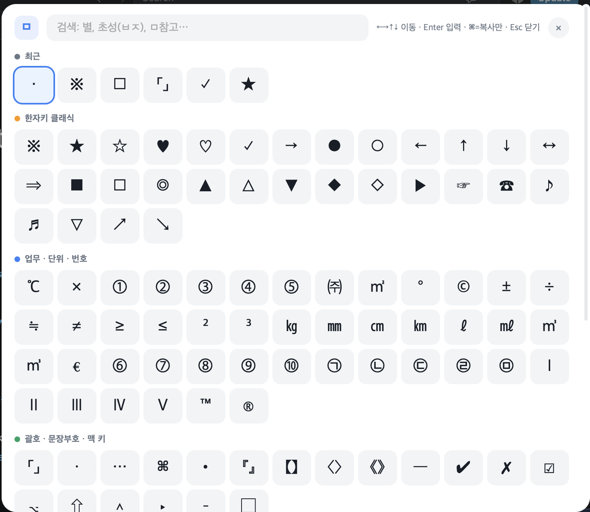

# ㅁ 특수문자 단축어 — 맥에서 윈도우 한자키처럼

윈도우 `ㅁ+한자` 대신, 맥 어디서든 **단축어 + 스페이스**로 특수문자를 입력합니다.

`ㅁ별`+스페이스 → ★ · `ㅁ참고` → ※ · `ㅁ1` → ① · `ㅁ제곱미터` → ㎡ … **총 99개**

**치트시트(웹)**: [`index.html`](./index.html) 을 브라우저로 열면 됩니다 — 검색(초성·영문 별칭 지원), 클릭 복사, 즐겨찾기, 외우기 퀴즈

## 1. 텍스트 대치 설치 — 필수, 1분

1. [`특수문자_텍스트대치.plist`](./특수문자_텍스트대치.plist) 를 다운로드 (Raw → ⌘S)
2. **시스템 설정 → 키보드 → 텍스트 대치…** 열기
3. plist 파일을 목록 안으로 **드래그**
4. 끝 — 한글 모드에서 `ㅁ별` + 스페이스를 누르면 ★이 됩니다. iCloud를 쓰면 iPhone·iPad에도 자동 동기화돼요.

## 2. ⌥ Space 버튼 팔레트 — 선택 (Hammerspoon)

99개 기호가 버튼 그리드로 한 화면에 뜨는 팔레트입니다.



- **클릭** = 커서 위치에 바로 입력 + 복사 · **⌘클릭** = 복사만
- **키보드 조작**: 파란 테두리 커서를 **방향키(←→↑↓)**로 옮기고 **Enter**로 입력해요
- 검색: 이름·단축어·**초성**(ㅂㅈ→별점) · 최근 사용 줄이 맨 위에 표시

```sh
brew install --cask hammerspoon   # Hammerspoon이 없다면
git clone https://github.com/INNO-HI-Inc/mac-special-chars.git
cd mac-special-chars && ./install.sh
```

## 단축어 규칙

- 모든 단축어는 **`ㅁ` 프리픽스**로 시작합니다 (윈도우 ㅁ+한자키 오마주). 한글 타이핑에서 "ㅁ+글자"는 자연적으로 나오지 않아 오작동이 없습니다.
- 짝 기호는 대칭 이름: `ㅁ별`★ / `ㅁ빈별`☆, `ㅁ하트`♥ / `ㅁ빈하트`♡
- 원문자는 `ㅁ1`~`ㅁ10`, 로마숫자는 `ㅁ로마1`~, 괄호는 쌍으로 입력(`ㅁ낫표` → 「」)
- 변환을 원치 않으면 변환 직후 ⌘Z

## 전체 목록

⭐ = 가장 많이 쓰는 필수 기호

<details><summary><b>한자키 클래식</b> (30개)</summary>

| 입력 | 결과 | 이름 |
|---|---|---|
| `ㅁ참고` | ※ | 당구장 표시(참고표) ⭐ |
| `ㅁ별` | ★ | 검은 별표 ⭐ |
| `ㅁ빈별` | ☆ | 빈 별표 ⭐ |
| `ㅁ하트` | ♥ | 검은 하트 ⭐ |
| `ㅁ빈하트` | ♡ | 빈 하트 ⭐ |
| `ㅁ체크` | ✓ | 체크 표시 ⭐ |
| `ㅁ오른` | → | 오른쪽 화살표 ⭐ |
| `ㅁ원` | ● | 검은 동그라미 ⭐ |
| `ㅁ빈원` | ○ | 빈 동그라미 ⭐ |
| `ㅁ왼` | ← | 왼쪽 화살표 |
| `ㅁ위` | ↑ | 위쪽 화살표 |
| `ㅁ아래` | ↓ | 아래쪽 화살표 |
| `ㅁ양쪽` | ↔ | 양쪽 화살표 |
| `ㅁ겹우` | ⇒ | 이중 화살표 |
| `ㅁ네모` | ■ | 검은 네모 |
| `ㅁ빈네모` | □ | 빈 네모 |
| `ㅁ겹원` | ◎ | 겹 동그라미 |
| `ㅁ세모` | ▲ | 검은 세모 |
| `ㅁ빈세모` | △ | 빈 세모 |
| `ㅁ역세모` | ▼ | 검은 역세모 |
| `ㅁ마름모` | ◆ | 검은 마름모 |
| `ㅁ빈마름모` | ◇ | 빈 마름모 |
| `ㅁ우삼각` | ▶ | 오른쪽 검은 삼각형 |
| `ㅁ우손` | ☞ | 오른쪽 손가락 |
| `ㅁ전화` | ☎ | 전화기 기호 |
| `ㅁ음표` | ♪ | 음표(8분음표) |
| `ㅁ겹음표` | ♬ | 겹음표 |
| `ㅁ빈역세모` | ▽ | 빈 역세모 |
| `ㅁ우상` | ↗ | 우상향 화살표 |
| `ㅁ우하` | ↘ | 우하향 화살표 |

</details>

<details><summary><b>업무 · 단위 · 번호</b> (45개)</summary>

| 입력 | 결과 | 이름 |
|---|---|---|
| `ㅁ섭씨` | ℃ | 섭씨 ⭐ |
| `ㅁ곱` | × | 곱하기표 ⭐ |
| `ㅁ1` | ① | 원문자 1 ⭐ |
| `ㅁ2` | ② | 원문자 2 ⭐ |
| `ㅁ3` | ③ | 원문자 3 ⭐ |
| `ㅁ4` | ④ | 원문자 4 ⭐ |
| `ㅁ5` | ⑤ | 원문자 5 ⭐ |
| `ㅁ주식` | ㈜ | 주식회사 기호 ⭐ |
| `ㅁ제곱미터` | ㎡ | 제곱미터 ⭐ |
| `ㅁ각도` | ° | 도(각도) |
| `ㅁ저작권` | © | 저작권 기호 |
| `ㅁ플마` | ± | 플러스마이너스 |
| `ㅁ나누기` | ÷ | 나누기표 |
| `ㅁ약` | ≒ | 약(근사)기호 |
| `ㅁ다름` | ≠ | 같지않음 |
| `ㅁ이상` | ≥ | 크거나같음 |
| `ㅁ이하` | ≤ | 작거나같음 |
| `ㅁ제곱` | ² | 위첨자 2 |
| `ㅁ세제곱` | ³ | 위첨자 3 |
| `ㅁ킬로그램` | ㎏ | 킬로그램(합자) |
| `ㅁ밀리미터` | ㎜ | 밀리미터(합자) |
| `ㅁ센티` | ㎝ | 센티미터(합자) |
| `ㅁ킬로미터` | ㎞ | 킬로미터(합자) |
| `ㅁ리터` | ℓ | 리터 |
| `ㅁ밀리리터` | ㎖ | 밀리리터(합자) |
| `ㅁ세제곱미터` | ㎥ | 세제곱미터 |
| `ㅁ루베` | ㎥ | 세제곱미터(루베) |
| `ㅁ유로` | € | 유로 |
| `ㅁ6` | ⑥ | 원문자 6 |
| `ㅁ7` | ⑦ | 원문자 7 |
| `ㅁ8` | ⑧ | 원문자 8 |
| `ㅁ9` | ⑨ | 원문자 9 |
| `ㅁ10` | ⑩ | 원문자 10 |
| `ㅁ원ㄱ` | ㉠ | 한글 원문자 ㄱ |
| `ㅁ원ㄴ` | ㉡ | 한글 원문자 ㄴ |
| `ㅁ원ㄷ` | ㉢ | 한글 원문자 ㄷ |
| `ㅁ원ㄹ` | ㉣ | 한글 원문자 ㄹ |
| `ㅁ원ㅁ` | ㉤ | 한글 원문자 ㅁ |
| `ㅁ로마1` | Ⅰ | 로마숫자 1 |
| `ㅁ로마2` | Ⅱ | 로마숫자 2 |
| `ㅁ로마3` | Ⅲ | 로마숫자 3 |
| `ㅁ로마4` | Ⅳ | 로마숫자 4 |
| `ㅁ로마5` | Ⅴ | 로마숫자 5 |
| `ㅁ상표` | ™ | 상표 기호 |
| `ㅁ등록상표` | ® | 등록상표 기호 |

</details>

<details><summary><b>괄호 · 문장부호 · 맥 키</b> (19개)</summary>

| 입력 | 결과 | 이름 |
|---|---|---|
| `ㅁ낫표` | 「」 | 홑낫표 ⭐ |
| `ㅁ점` | · | 가운뎃점 ⭐ |
| `ㅁ줄임` | … | 말줄임표 ⭐ |
| `ㅁ커맨드` | ⌘ | 커맨드 키 ⭐ |
| `ㅁ불릿` | • | 불릿(글머리점) ⭐ |
| `ㅁ겹낫표` | 『』 | 겹낫표 |
| `ㅁ검은괄호` | 【】 | 검은괄호(실괄호) |
| `ㅁ꺾쇠` | 〈〉 | 홑화살괄호 |
| `ㅁ겹꺾쇠` | 《》 | 겹화살괄호 |
| `ㅁ줄표` | — | 줄표(엠 대시) |
| `ㅁ굵은체크` | ✔ | 굵은 체크 |
| `ㅁ엑스` | ✗ | 엑스 표시(벌러트 X) |
| `ㅁ체크박스` | ☑ | 체크된 체크박스 |
| `ㅁ옵션` | ⌥ | 옵션 키 |
| `ㅁ시프트` | ⇧ | 시프트 키 |
| `ㅁ컨트롤` | ⌃ | 컨트롤 키 |
| `ㅁ토글` | ▸ | 작은 오른쪽 삼각형 |
| `ㅁ엔대시` | – | 엔 대시 |
| `ㅁ빈박스` | ☐ | 빈 체크박스 |

</details>

<details><summary><b>조합</b> (5개)</summary>

| 입력 | 결과 | 이름 |
|---|---|---|
| `ㅁ별점1` | ★☆☆☆☆ | 별점 1점 |
| `ㅁ별점2` | ★★☆☆☆ | 별점 2점 |
| `ㅁ별점3` | ★★★☆☆ | 별점 3점 |
| `ㅁ별점4` | ★★★★☆ | 별점 4점 |
| `ㅁ별점5` | ★★★★★ | 별점 5점 |

</details>

## 커스터마이즈

1. [`entries.json`](./entries.json) 에서 기호/단축어를 수정·추가
2. `python3 scripts/build.py` — plist·치트시트(index.html)·팔레트가 한 번에 재생성됩니다
3. plist를 다시 드래그하고, 팔레트는 `./install.sh` 후 Hammerspoon 리로드

### 개인 항목 — 로컬 전용

연락처·이메일처럼 **공개하면 안 되는 값**은 `entries.json`이 아니라 `entries.local.json` 에 넣습니다.
이 파일은 `.gitignore` 대상이라 저장소에 올라가지 않습니다.

```sh
cp entries.local.example.json entries.local.json   # 형식 참고
# entries.local.json 편집 후
python3 scripts/build.py && ./install.sh
```

빌드하면 개인 항목은 **`.local.` 산출물에만** 병합됩니다.

| 산출물 | 개인 항목 | git |
|---|---|---|
| `entries.json` · `index.html` · `특수문자_텍스트대치.plist` · `special_chars_palette.html` | 미포함 | 커밋됨 |
| `특수문자_텍스트대치.local.plist` · `special_chars_palette.local.html` | 포함 | 제외 |

텍스트 대치는 `특수문자_텍스트대치.local.plist` 를 드래그하고, 팔레트는 `.local.html` 이 있으면 자동으로 그쪽을 씁니다.
단축어가 공개 항목과 겹치면 빌드가 중단됩니다.

## 라이선스

[MIT](./LICENSE)
